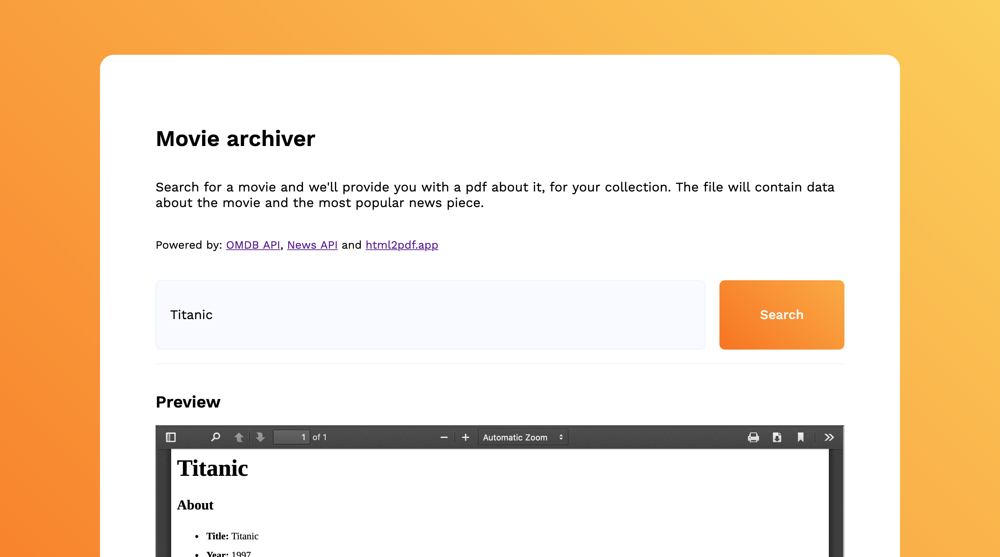
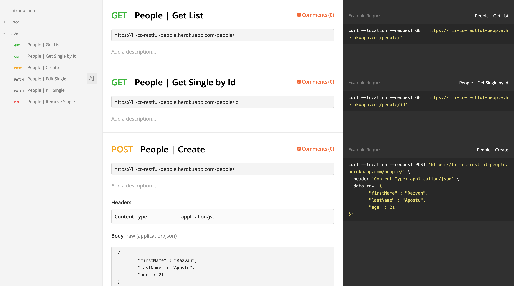
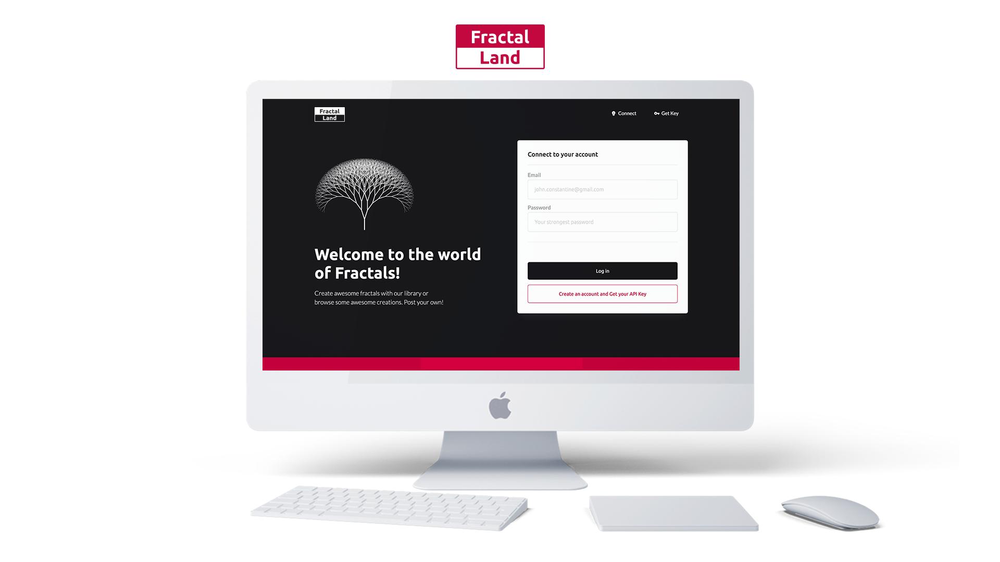

# fii-cc

# Projects for CC (Cloud Computing) course 2019-2020 (UAIC Cuza 2020, Faculty Of Computer Science)

#### Collection

[1. Movie-Archiver](##movie-archiver)  
[2. Restful-People](##restful-people)  
[3. Social-Network](##cocial-network)  
[4. Fractal-Land](##fractal-land)

---

## Movie-Archiver

[Feb 27, 2020] **`/movie-archiver`** → API aggregator (OMDB, News, Html2Pdf)  
#nodejs

**Live preview**

1.  Visit [https://fii-cc-movie-archiver.herokuapp.com/home](https://fii-cc-movie-archiver.herokuapp.com/home)

**Local setup**

1.  run `nodemon server.js` or `npm run develop`
2.  navigate to `localhost:4000/home` or `localhost:4000/metrics` or `localhost:4000/?title=movietitle`

---

## Restful-People

[Mar 12, 2020] **`/restful-people`** → RESTful solution for a people ledger/directory  
#nodejs #mongodb

**Live preview**

1.  Visit [https://fii-cc-restful-people.herokuapp.com/people](https://fii-cc-restful-people.herokuapp.com/people)
2.  Or watch a demo on youtube [https://www.youtube.com/watch?v=15VcwAY24HQ](https://www.youtube.com/watch?v=15VcwAY24HQ)

**Local setup**

1.  run `nodemon server.js` or `npm run develop`
2.  navigate to `localhost:4001/people` and play with all the CRUD actions on the directory of people

**Exposed functionality**

The API will provide functionality for (_format specified in Postman_):

1.  Creating a person (`POST people/`)
2.  Retrieving a person's data (`GET people/:id`)
3.  Editing a person's data (`PATCH people/:id`)
4.  Removing a person (`DELETE people/:id`)
5.  Marking a person as dead (`PATCH people/:id/kill`)

    ***

6.  Retrieving all people in the directory (`GET people/`)
7.  Connecting two inidividuals (e.g. _A and B are 'Friends/...'_) (`POST people/:id1/:id2`)
8.  Disconnecting two inidividuals (removing one type of connection) (e.g. _A and B aren't 'Friends' any more_) (`DELETE people/:id1/:id2`)
9.  Replacing all connections between two inidividuals (`PUT people/:id1/:id2`)

## Social-Network

[April 2, 2020] **`/social-network`** → A social network powered by nodejs and Google APIs & Services
#nodejs #express #google
#Alex+Razvan

**Local setup**

1.  run `nodemon server.js` or `npm run develop`
2.  navigate to `localhost:4001/`

---

**Story**

1. Setup a Nodejs & Express system, ready for server side rendering
2. Upload the project to a git repository and ~~implement CI/CD with Google Cloud Build~~ (stopped: trigger created, but how do you bind env vars the right way...)
3. `gcloud app deploy` with **Google App Engine**
4. Integrate google sign in and the "amazing" custom auth flow.
   - Reference: https://firebase.google.com/docs/auth/web/google-signin (advanced flow with manual sign-in and nodejs host)
5. Big reveal. Add handlebars to the mess.
6. Implement Firebase Auth and Firestore
7. Implement Maps API and Geocode
8. Create-post page
9. News feed

## Social-Network-Azure

[Apr 30, 2020] **`/social-network-azure`** -> A social network powered by nodejs and Microsoft Azure APIs & Services
#nodejs #express #azure
#Alex + Razvan

**Cloud deployment links**

1. Backend app : https://fii-cc-social-network.azurewebsites.net/posts/
2. Frontend app : https://fiisocialnetworkfront.z22.web.core.windows.net/

## Fractal-Land

[Final Project] **`/fractal-land`** -> A fractal builder library and platform
#nodejs #aws #lambda #html #css
#Alex + Razvan

**Live preview**
https://www.fii-cc.com.s3.amazonaws.com/index.html

**Exposed functionality**

1. An API that handles user registration, key/token management, fractal creation + others. Deployed with AWS Lambda Functions and **Serverless**.
2. A MongoDB database to store valuable data
3. A Web Platform (HTML, CSS, Vanilla JS) to help with the creation and management of fractals. Deployed in an S3 Bucket, https handled with Cloud Front.
4. A library deployed to NPM for use outside of the platform (relies on user public keys that can be acquired with a Fractal-Land account).
